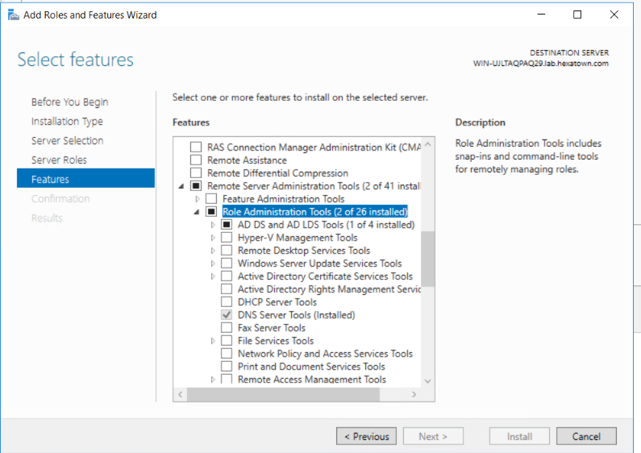
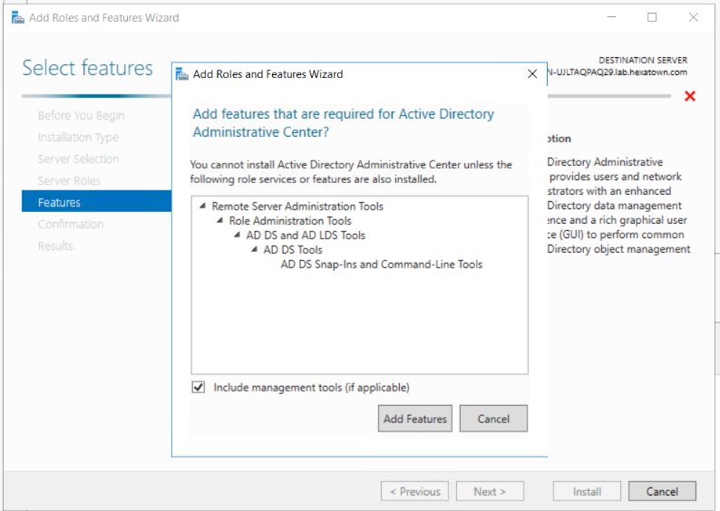
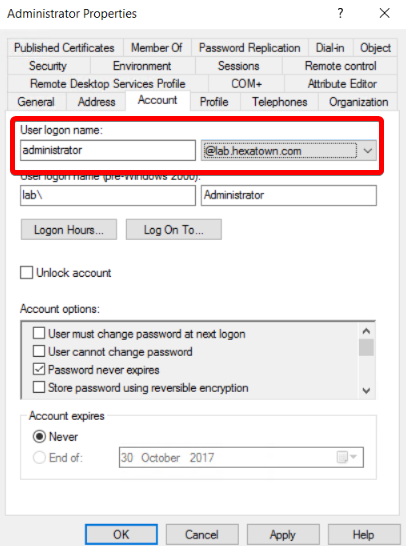

# Domain controller
## Todo
[ ] Automate step 3
 
(https://blogs.technet.microsoft.com/uktechnet/2016/06/08/setting-up-active-directory-via-powershell/)

## Step 1 

```powershell
Set-ExecutionPolicy Bypass; iex ((New-Object System.Net.WebClient).DownloadString('https://raw.githubusercontent.com/Hexatown/lab/master/domaincontroller/step001.ps1'))
```

## Step 2
(https://chocolatey.org/install)

```powershell
Set-ExecutionPolicy Bypass; iex ((New-Object System.Net.WebClient).DownloadString('https://chocolatey.org/install.ps1'))
```
(https://chocolatey.org/packages/RSAT)
```dos
choco install rsat
```
## Step 3




(https://technet.microsoft.com/en-us/library/dd379481(v=ws.10).aspx)

Enable-ADOptionalFeature –Identity ‘CN=Recycle Bin Feature,CN=Optional Features,CN=Directory Service,CN=Windows NT,CN=Services,CN=Configuration,DC=contoso,DC=com’ –Scope ForestOrConfigurationSet –Target ‘contoso.com’